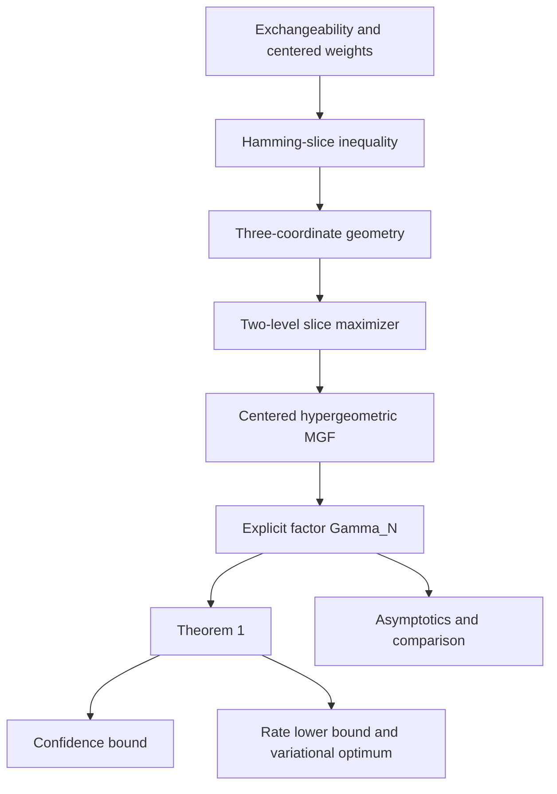

<h1 align="center">Exchangeable Hoeffding in Lean</h1>

<p align="center">
  Lean 4 formalization of <em>A Sharper Hoeffding Bound for Weighted Sums of Exchangeable Random Variables</em>
</p>

<p align="center">
  <a href="https://arxiv.org/abs/2608.04900"></a>
  <a href="https://statchan1106.github.io/exchangeable-hoeffding-lean/"></a>
  <a href="https://github.com/statchan1106/exchangeable-hoeffding-lean/actions/workflows/lean_action_ci.yml?query=branch%3Amain"></a>
</p>

<p align="center">
  <a href="https://statchan1106.github.io/">Seongchan Lee</a>
  &nbsp;·&nbsp;
  <a href="https://ilmunk.github.io/index.html">Ilmun Kim</a>
</p>

This repository is the machine-checked companion to the paper's concentration
bound for weighted sums of bounded exchangeable random variables. It records
both the paper-facing proof architecture and the shorter kernel dependency used
by the exported main theorem.

## Start here

| If you want to... | Open... |
|---|---|
| Understand the result without reading Lean | [Reader's guide](https://statchan1106.github.io/exchangeable-hoeffding-lean/) |
| Follow the paper's proof in dependency order | [Proof guide](https://statchan1106.github.io/exchangeable-hoeffding-lean/proof.html) or [blueprint/README.md](blueprint/README.md) |
| Match a numbered paper result to Lean | [Declaration map](https://statchan1106.github.io/exchangeable-hoeffding-lean/declarations.html) or [blueprint/DECLARATIONS.md](blueprint/DECLARATIONS.md) |
| Inspect the public Lean interface | `import ExchangeableHoeffding` |
| Understand the stronger finite-population foundation | [Sharp Serfling in Lean](https://github.com/statchan1106/sharp-serfling-lean) |

## Main result

Let \(X_1,\ldots,X_N\in[-1,1]\) be exchangeable, let
\(w_1,\ldots,w_n\in\mathbb R\), and let
\(P_{\mathbf1^\perp}\widetilde w\) denote the centered version of the
weights after padding them with zeros to length \(N\). Theorem 1 proves

$$
\log \mathbb E\exp\!\left(
  \lambda\sum_{i=1}^n w_i(X_i-\bar X_N)
\right)
\le
\frac{\lambda^2}{2}\,\Gamma_N
\lVert P_{\mathbf1^\perp}\widetilde w\rVert_2^2.
$$

Only the centered weight vector appears because adding a constant to every
padded coefficient does not change a contrast against the sample mean. The
inflation factor is the explicit finite maximum

$$
\Gamma_N=
\max_{1\le s\le\lfloor N/2\rfloor}
\frac{N(N-s)}s
\sum_{\ell=N-s}^{N-1}\frac1{\ell^2},
\qquad
\Gamma_N=1+\frac{3}{2N}+O(N^{-2}).
$$

The main Lean entry points are:

- `SharpSerfling.ExchangeableHoeffding.theorem_1_mgf`;
- `SharpSerfling.ExchangeableHoeffding.theorem_1_upperTail`;
- `SharpSerfling.ExchangeableHoeffding.corollary_1`.

## The paper proof in one view



The central mechanism is a sequence of reductions: exchangeability removes the
ordering, convexity reduces the bounded cube to sign vectors, a slice maximizer
is shown to have two coefficient levels, and the remaining random variable is
a centered hypergeometric count.

## Paper route and kernel route

Both routes are checked, but they answer different questions.

| Route | Purpose | Endpoint |
|---|---|---|
| Paper-facing route | Mirrors the explanatory proof through Hamming slices, the Hermite/three-coordinate argument, Proposition 2, and Lemma 4 | Every numbered paper result has a matching Lean declaration |
| Kernel route for Theorem 1 | Uses the stronger sharp finite-population coefficient and proves it is bounded by \(\Gamma_N\) | `weighted_exchangeable_mgf_centeredNorm_inLaw → sharpCoefficient_le_Gamma → theorem_1_mgf` |

The shorter kernel route does not replace or obscure the paper proof. The
structural lemmas remain independently formalized interfaces, while the
exported theorem reuses the strongest available certificate. The vendored
foundation is developed independently in
[Sharp Serfling in Lean](https://github.com/statchan1106/sharp-serfling-lean).

## Formalized paper results

| Paper result | Mathematical role | Lean declaration |
|---|---|---|
| Theorem 1 | Main exchangeable MGF inequality | `theorem_1_mgf` |
| Corollary 1 | Confidence-parameter tail bound | `corollary_1` |
| Proposition 1 | Parity-dependent rate lower bound | `proposition_1` |
| Remark 1 | Exact variational characterization | `remark_1_variational` |
| Lemma 1 | Hoeffding's lemma | `lemma_1_hoeffding` |
| Lemma 2 | Hermite weighted-derivative sign | `lemma_2_hermite_sign` |
| Lemma 3 | Three-coordinate maximizer obstruction | `lemma_3_three_coordinate` |
| Proposition 2 | Existence of a two-level maximizer | `proposition_2_two_level` |
| Lemma 4 | Centered hypergeometric MGF bound | `lemma_4_hypergeometric` |
| Lemma 5 | Comparison with the earlier coefficient | `lemma_5`, `lemma_5_eq_two` |

## Repository layout

| Path | Role |
|---|---|
| `ExchangeableHoeffding/` | Paper-facing definitions, constants, structural lemmas, theorem interfaces, and optimality results |
| `vendor/sharp-serfling-lean/` | Kernel-checked finite-population foundation used by the exported theorem |
| `blueprint/` | Detailed mathematical proof guide and declaration audit |
| `docs/` | Reader-oriented GitHub Pages site |
| `AxiomAudit.lean` | Public-theorem assumption audit |

## Build and verify

```sh
git clone https://github.com/statchan1106/exchangeable-hoeffding-lean.git
cd exchangeable-hoeffding-lean
lake exe cache get
lake build
lake env lean AxiomAudit.lean
```

The same build and audit run in GitHub Actions.

## Trust boundary

The active Lean sources contain no `sorry`, `admit`, project-defined
`axiom`, `unsafe`, or `implemented_by`. The public theorem audit reports
only the standard logical foundations inherited from Lean and Mathlib:
`propext`, `Classical.choice`, and `Quot.sound`.
