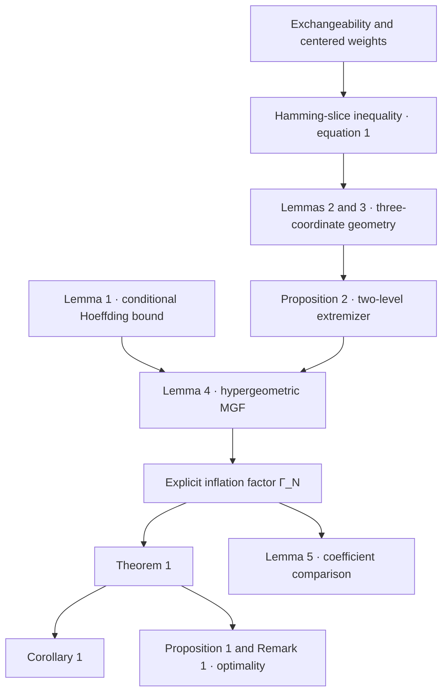

<h1 align="center">Exchangeable Hoeffding in Lean</h1>

<p align="center">
  Lean formalization of <em>A Sharper Hoeffding Bound for Weighted Sums of Exchangeable Random Variables</em>
</p>

<p align="center">
  <a href="https://arxiv.org/abs/2608.04900"></a>
  <a href="blueprint/"></a>
  <a href="https://github.com/statchan1106/exchangeable-hoeffding-lean/actions/workflows/lean_action_ci.yml?query=branch%3Amain"></a>
</p>

<p align="center">
  <a href="https://statchan1106.github.io/">Seongchan Lee</a>
  &nbsp;·&nbsp;
  <a href="https://ilmunk.github.io/index.html">Ilmun Kim</a>
</p>

This repository formalizes the paper's concentration bound for weighted sums of bounded exchangeable random variables. The development includes the main moment-generating-function inequality, its confidence bound, the explicit inflation factor, the structural reduction to a two-level extremizer, the hypergeometric estimate, and the optimality statements.

## Contents

- [Main result](#main-result)
- [Formalized results](#formalized-results)
- [Proof architecture](#proof-architecture)
- [Project guide](#project-guide)
- [Build and verify](#build-and-verify)
- [Repository layout](#repository-layout)
- [Trust boundary](#trust-boundary)

## Main result

Let $X_1,\ldots,X_N\in[-1,1]$ be exchangeable, let $w_1,\ldots,w_n$ be real weights, and let $P_{\mathbf 1^\perp}\widetilde w$ be the centered, zero-padded weight vector. Theorem 1 proves

```math
\log \mathbb{E}\exp\!\left(
  \lambda\sum_{i=1}^n w_i(X_i-\bar X_N)
\right)
\le
\frac{\lambda^2}{2}\,\Gamma_N
\lVert P_{\mathbf 1^\perp}\widetilde w\rVert_2^2.
```

The Lean statement is `theorem_1_mgf`. Its notation is represented by `exchangeableMgf`, `centeredWeight`, `sqNorm`, and `Gamma`.

## Formalized results

| Paper result | Mathematical role | Lean declaration |
|---|---|---|
| Theorem 1 | Main exchangeable MGF inequality | `theorem_1_mgf` |
| Corollary 1 | Confidence-parameter tail bound | `corollary_1` |
| Proposition 1 | Parity-dependent rate lower bound | `proposition_1` |
| Remark 1 | Exact variational characterization | `remark_1_variational` |
| Lemma 1 | Hoeffding's lemma | `lemma_1_hoeffding` |
| Lemma 2 | Hermite weighted-derivative sign | `lemma_2_hermite_sign` |
| Lemma 3 | Three-coordinate maximizer obstruction | `lemma_3_three_coordinate` |
| Proposition 2 | Existence of a two-level maximizer | `proposition_2_two_level` |
| Lemma 4 | Centered hypergeometric MGF bound | `lemma_4_hypergeometric` |
| Lemma 5 | Comparison with the earlier coefficient | `lemma_5` |

## Proof architecture



The paper-facing route and the shorter kernel dependency of the exported main theorem are documented separately. This avoids presenting explanatory structural lemmas as direct dependencies when the final theorem uses a stronger finite-population certificate.

## Project guide

| Entry point | Purpose |
|---|---|
| [Project page](https://statchan1106.github.io/exchangeable-hoeffding-lean/) | Main theorem, notation, and recommended reading order |
| [Proof Blueprint](blueprint/) | Paper equations, Lean statements, and the dependency hierarchy |
| [Declaration audit](blueprint/DECLARATIONS.md) | Compact result-by-result traceability table |

## Build and verify

```sh
git clone https://github.com/statchan1106/exchangeable-hoeffding-lean.git
cd exchangeable-hoeffding-lean
lake exe cache get
lake build
lake env lean AxiomAudit.lean
```

The same build and axiom audit run in GitHub Actions.

## Repository layout

| Path | Role |
|---|---|
| `ExchangeableHoeffding/` | Paper-facing definitions and theorem interfaces |
| `vendor/sharp-serfling-lean/` | Kernel-checked finite-population foundation used by the main theorem |
| `blueprint/` | GitHub-readable proof guide and declaration map |
| `docs/` | Reader-oriented project page |
| `AxiomAudit.lean` | Public-theorem assumption audit |

## Trust boundary

The active Lean sources contain no `sorry`, `admit`, project-defined `axiom`, `unsafe`, or `implemented_by`. The public theorem audit reports only the standard logical foundations inherited from Lean and Mathlib: `propext`, `Classical.choice`, and `Quot.sound`.
